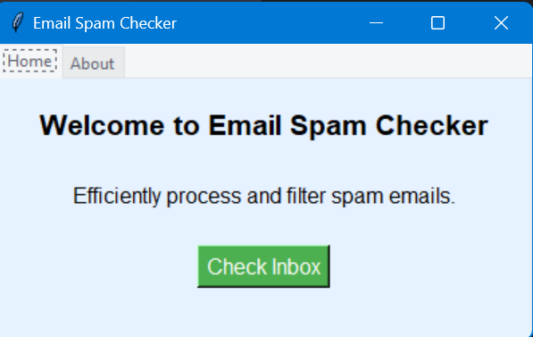
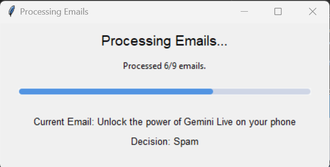

# AUTO Email Spam Checker

A simple application to check for spam emails from a Gmail inbox using Python, IMAP, and a machine learning model for spam classification. The application continuously monitors the inbox, fetches emails, and classifies them as either spam or ham (non-spam). If an email is classified as spam, it is moved to the Spam folder, and the subject is logged.




## Features

- Connects to Gmail using IMAP to fetch unread emails.
- Classifies emails as spam or ham using a machine learning model.
- Moves spam emails to the Gmail Spam folder.
- Logs the subjects of spam emails to a text file (`spam_emails.txt`).
- Provides a simple Tkinter UI to start and stop the email checking process.
- Displays the count of spam emails caught in the UI.
- Supports continuous email monitoring to check for any recent email for spam.
- Supports AUTO fetching and checking of all emails in the inbox to get rid of past spam mails.
  
## Requirements

- Python 3.x
- Required Python packages:
  - `imaplib` (for connecting to Gmail and fetching emails)
  - `email` (for parsing the email data)
  - `re` (for text processing)
  - `time` (for setting a check interval)
  - `threading` (to run email checking in the background)
  - `sklearn` (for machine learning model)
  - `tkinter` (for the UI)
  - `numpy`, `pandas`, `matplotlib` (for data processing and visualization)

Install the required packages using the following command:

```bash
pip install -r requirements.txt
```

## Configuration

Before running the application, configure the following variables:

- `IMAP_SERVER`: The IMAP server address for Gmail (`imap.gmail.com`).
- `EMAIL`: Your Gmail address (e.g., `your-email@gmail.com`).
- `PASSWORD`: Your Gmail "app password". You may need to create an "app password", need to use Gmail with 2-factor authentication, then search for app password (it will be 16-character long).

## Usage

1. Clone the repository.

2. **Train the model** (make sure to name the dataset `new.csv`), then start the "With GUI" to interact with the email spam checker.

3. The application provides two main functionalities:

   - **Start Checker**: Starts the background thread to continuously fetch recent mails and classify them spam/ham.
   - **Stop Checker**: Stops the background thread, halting the email checking process.

4. The application also allows **AUTO checking of all emails in inbox** at once.

5. All subjects of spam emails are logged in a file called `spam_emails.txt`.

## Dataset

The model is trained using a dataset obtained from two Kaggle sources. After combining them, the datasets contain 17,000 labeled email data, where each email is marked as either spam or ham (non-spam). 

- The two datasets are:
  1. [[Link 1](https://www.kaggle.com/datasets/venky73/spam-mails-dataset)]
  2. [[Link 2](https://www.kaggle.com/datasets/jackksoncsie/spam-email-dataset)]

These datasets were merged using **Pandas** to create a unified dataset for training the model. After merging, some preprocessing steps were applied to clean the data, such as:

- Removing any unnecessary whitespace or special characters.
- Standardizing the text format.
- Splitting the data into feature vectors and labels for model training.

## Model Training

The spam classification model is trained using different machine learning algorithms. The following models are used:
- **Models Used**: 
  - **Logistic Regression**: A linear model for binary classification.
  - **Decision Tree Classifier**: A tree-based model that splits the data into subsets based on feature values.
  - **Random Forest Classifier**: An ensemble method that combines multiple decision trees to improve classification performance.

- **Model Evaluation**:
  - Models are evaluated using metrics such as:
    - **Accuracy**: Proportion of correct predictions.
    - **Precision**: Proportion of positive predictions that were correct.
    - **Recall**: Proportion of actual positives that were correctly identified.
    - **F1-Score**: Harmonic mean of precision and recall.

## Contributing

Feel free to fork this project and contribute by opening issues or submitting pull requests.

## License

This project is licensed under the MIT License - see the [LICENSE](LICENSE) file for details.